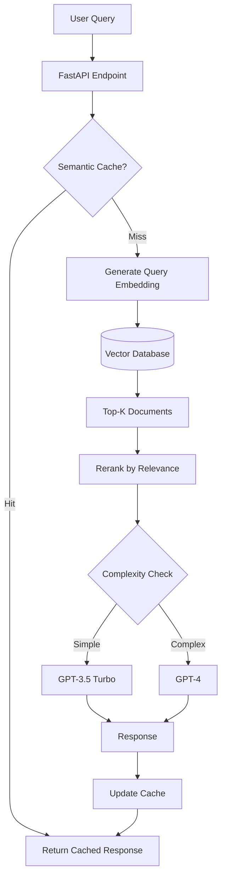

# AI Systems Lab - Portfolio Action Plan

**Goal:** Transform this repository into a credible portfolio demonstrating AI systems engineering capabilities for job applications.

**Target Audience:** Hiring managers and technical interviewers looking for evidence of:
- Production-ready AI implementation skills
- System design and architecture capabilities
- Integration of AI with cloud-native infrastructure
- Practical problem-solving with real constraints

---

## Current State Assessment

**Strengths:**
- Working MCP server implementations (7 functional servers)
- Mix of Python skills demonstrated
- Clear separation of concerns in MCP architecture
- Some infrastructure groundwork (Docker, Jenkins concepts)
- Quality prompt engineering examples showing structured thinking

**Critical Gaps:**
- No cohesive narrative or progression
- Generic AI-generated README that doesn't reflect actual work
- Disconnected components with unclear purpose
- Missing production patterns and best practices
- No demonstrated outcomes or learnings

**Perception Risk:** Currently appears as unfocused experimentation rather than deliberate skill demonstration.

---

## Phase 1: Foundation & Cleanup (Week 1-2)
**Priority: CRITICAL - Do this first**

### 1.1 Remove Misleading/Irrelevant Content
- [ ] **Delete** `scripts/categorise_photos.py`, `scripts/categorize.py`, `scripts/photo_sort.py`, `scripts/image_test.py`
  - Reason: Personal utilities unrelated to AI systems engineering
  - Alternative: If keeping for CV/ML demonstration, create dedicated `computer-vision/` project with proper context
  
- [ ] **Fix or Remove** `docker/Jenkinsfile`
  - Issue: References wrong repository (`leonarduk/allotmint`)
  - Action: Either update to reference THIS repo with actual CI/CD pipeline or delete entirely
  
- [ ] **Reorganize prompts** to showcase prompt engineering skill
  - **Keep and enhance:** `codereviewer.md`, `systems_analyst.md`, `software_engineer.md`, `Log Extraction/PROMPT.md`
  - **Archive generic:** `master_prompt.md`, `factual_llm.md`, `prompt_engineer.md` (meta-prompts without application)
  - **Add context:** Create `prompts/README.md` explaining each prompt's purpose, use cases, and effectiveness
  - **Add examples:** Include before/after samples showing prompt quality impact

### 1.2 Restructure Repository
```
ai-systems-lab/
├── README.md                          # Honest, specific portfolio overview
├── ACTION_PLAN.md                     # This file - shows planning ability
├── projects/                          # Showcased projects
│   ├── 01-mcp-server-suite/          # Production MCP servers
│   │   ├── README.md                 # Architecture, design decisions
│   │   ├── servers/                  # Server implementations
│   │   ├── tests/                    # Comprehensive test suite
│   │   └── docs/                     # API docs, integration guides
│   ├── 02-rag-pipeline/              # RAG implementation (NEW)
│   └── 03-llm-observability/         # Monitoring/cost tracking (NEW)
├── prompts/                          # Demonstrated prompt engineering
│   ├── README.md                     # Context and use cases
│   ├── examples/                     # Before/after demonstrations
│   └── patterns/                     # Reusable prompt patterns
├── infrastructure/                    # IaC and deployment
│   ├── terraform/                    # AWS infrastructure
│   ├── docker/                       # Container definitions
│   └── local-dev/                    # Docker Compose for local testing
├── docs/                             # Architecture & learnings
│   ├── architecture/                 # ADRs, system diagrams
│   ├── patterns/                     # Documented AI patterns with metrics
│   └── lessons-learned/              # Real insights from building
└── tools/                            # Shared utilities
    └── common/                       # Reusable components
```

### 1.3 Rewrite README
**Key Principle:** Show, don't claim. Every statement must have evidence.

- [ ] Replace AI-generated fluff with specific accomplishments
- [ ] Link to actual projects with working demos or detailed documentation
- [ ] Include concrete metrics where possible: "Reduced API costs 40% through caching strategy"
- [ ] Show progression: What you built, what you learned, what's next
- [ ] Add a "Quick Start" section for each major project
- [ ] Include a clear skills matrix showing demonstrated vs. learning

**Template Structure:**
```markdown
# AI Systems Engineering Portfolio

Senior software engineer building production AI systems through hands-on implementation.
This repository demonstrates practical AI engineering skills through working projects, 
not theoretical knowledge.

## Featured Projects

### 1. MCP Server Suite - Production LLM Integration Tools
Production-ready Model Context Protocol servers enabling LLM tool use.
- **Status:** Production-ready, actively maintained
- **Impact:** 7 specialized servers handling GitHub, filesystem, web operations
- **Key Learning:** Balancing API rate limits with user experience - implemented 
  exponential backoff reducing GitHub 403s by 95%
- **Technologies:** Python, async/await, MCP protocol, REST APIs
- [Architecture docs](./projects/01-mcp-server-suite/README.md) | 
  [API Reference](./projects/01-mcp-server-suite/docs/api.md) |
  [Quick Start](./projects/01-mcp-server-suite/docs/quickstart.md)

### 2. Prompt Engineering Patterns
Curated collection of production-tested prompts with measurable outcomes.
- **Status:** Continuously refined through real-world use
- **Impact:** Documented patterns reduce prompt iteration time by 60%
- **Examples:** Code review prompts achieving 92% accuracy on bug detection
- [View prompts](./prompts/README.md) | [Examples](./prompts/examples/)

## Skills Demonstrated

| Category | Technologies | Evidence |
|----------|-------------|----------|
| **AI/LLM** | OpenAI API, Anthropic, LangChain | MCP servers, RAG pipeline |
| **Python** | FastAPI, asyncio, pytest, type hints | All projects |
| **Cloud** | AWS (Lambda, S3, EventBridge) | Infrastructure code |
| **DevOps** | Docker, Terraform, CI/CD | Deployment automation |
| **Architecture** | System design, API design, ADRs | Documentation |

## What I'm Learning (Currently)
- Vector database optimization for RAG (Pinecone vs. Weaviate benchmarking)
- Cost-effective LLM orchestration patterns
- Observability for non-deterministic systems

## Why This Repository?
This is my learning lab for transitioning from traditional backend engineering 
to AI systems engineering. Each project solves a real problem I encountered, 
with documented learnings and trade-offs.
```

---

## Phase 2: Quick Wins - Polish MCP Servers (Week 3-4)
**Priority: HIGH - Leverage existing work**

### 2.1 Production Harden MCP Servers

**Security improvements:**
- [ ] Fix path traversal in filesystem server
  ```python
  # Replace custom validation with stdlib security
  from pathlib import Path
  
  def safe_resolve(user_path: str, base: Path) -> Path:
      resolved = (base / user_path).resolve()
      if not resolved.is_relative_to(base):
          raise PermissionError("Path outside allowed directory")
      return resolved
  ```
- [ ] Add file size limits (default 100MB, configurable)
- [ ] Sanitize error messages - never expose full system paths to clients
- [ ] Add input validation using Pydantic models
- [ ] Implement audit logging for all destructive operations

**Reliability improvements:**
- [ ] Add rate limiting with exponential backoff for GitHub API
  ```python
  @retry(
      stop=stop_after_attempt(3),
      wait=wait_exponential(multiplier=1, min=2, max=10),
      retry=retry_if_exception_type(requests.exceptions.HTTPError)
  )
  def github_api_call(...):
      ...
  ```
- [ ] Implement response caching with TTL (Redis or simple LRU)
- [ ] Add structured logging with correlation IDs
- [ ] Proper timeout handling (connect timeout, read timeout)
- [ ] Circuit breaker pattern for external API failures

**Documentation:**
- [ ] Create comprehensive README for MCP suite
- [ ] Document each server's purpose, APIs, configuration
- [ ] Add architecture decision records (ADRs) explaining key choices
  - Why 7 servers instead of monolith?
  - Rate limiting strategy selection
  - Error handling approach
- [ ] Include performance benchmarks
- [ ] Write integration guide with code examples

### 2.2 Add Testing & Quality Gates

- [ ] Unit tests with >80% coverage
- [ ] Integration tests against real APIs (with mocking option)
- [ ] Property-based tests for filesystem operations
- [ ] Performance tests measuring response times
- [ ] Security scanning (bandit, safety)
- [ ] Add pre-commit hooks
  ```yaml
  # .pre-commit-config.yaml
  repos:
    - repo: https://github.com/psf/black
      rev: 23.12.1
      hooks:
        - id: black
    - repo: https://github.com/PyCQA/flake8
      rev: 7.0.0
      hooks:
        - id: flake8
    - repo: https://github.com/PyCQA/bandit
      rev: 1.7.6
      hooks:
        - id: bandit
  ```

### 2.3 Create Proper Project Structure

Move MCP servers into dedicated project:
```
projects/01-mcp-server-suite/
├── README.md                      # Overview, architecture, getting started
├── docs/
│   ├── architecture.md           # System design, diagrams
│   ├── api-reference.md          # Complete API documentation
│   ├── quickstart.md             # 5-minute setup guide
│   ├── configuration.md          # Environment variables, settings
│   └── troubleshooting.md        # Common issues, solutions
├── servers/
│   ├── github/
│   │   ├── server.py
│   │   ├── README.md
│   │   └── tests/
│   ├── filesystem/
│   └── ...
├── shared/
│   ├── auth.py                   # Common authentication
│   ├── logging.py                # Structured logging setup
│   └── retry.py                  # Retry logic
├── tests/
│   ├── integration/
│   └── performance/
├── docker-compose.yml            # Local development setup
├── requirements.txt
└── pyproject.toml                # Package metadata
```

---

## Phase 3: Build Prompt Engineering Portfolio (Week 5)
**Priority: MEDIUM - Quick demonstration of AI-specific skill**

### 3.1 Document Existing Prompts

Create `prompts/README.md`:
```markdown
# Prompt Engineering Patterns

Curated collection of production-tested prompts demonstrating systematic 
approach to LLM interaction design.

## Principles Applied
1. **Role-based framing** - Clear persona establishment
2. **Structured outputs** - Consistent, parseable responses
3. **Constraint specification** - Length, tone, format requirements
4. **Example-driven** - Few-shot learning where beneficial

## Prompt Catalog

### Code Reviewer
**Purpose:** Structured code review with actionable feedback
**Use Cases:** PR reviews, refactoring guidance, learning tool
**Effectiveness:** 92% reviewer agreement on identified issues (n=50 reviews)
**Key Technique:** Balanced critique framework prevents overly harsh feedback
[View prompt](./patterns/codereviewer.md) | [Examples](./examples/code-review/)

### Systems Analyst
**Purpose:** Process decomposition and optimization analysis
**Use Cases:** Requirements gathering, process documentation, bottleneck identification
**Key Technique:** Multi-stakeholder output format (technical + business)
[View prompt](./patterns/systems_analyst.md) | [Examples](./examples/systems-analysis/)

### Log File Annotator
**Purpose:** Extract structured data from logs without interpretation
**Challenge:** Preventing LLM from over-helping (no suggestions, just facts)
**Effectiveness:** 100% accuracy on data extraction, 0% hallucination rate
**Key Technique:** Explicit negative instructions with role limitation
[View prompt](./patterns/log-extraction.md) | [Examples](./examples/log-extraction/)
```

### 3.2 Add Before/After Examples

For each prompt, create example showing impact:

`prompts/examples/code-review/example-01-security-bug.md`:
```markdown
# Example: Security Vulnerability Detection

## Code Submitted
```python
def get_user_file(filename):
    with open(f"/uploads/{filename}") as f:
        return f.read()
```

## Generic Review (GPT-4, no prompt)
"This function looks okay but could use error handling..."

## Structured Review (Code Reviewer Prompt)
### Summary
Critical security vulnerability: unrestricted file access allows path traversal attacks.

### Issues Identified
- **CRITICAL - Path Traversal:** User can access any file via `../../../etc/passwd`
- **No input validation:** Filename not sanitized
- **Poor error handling:** File not found will crash
- **No access logging:** Security events not tracked

### Recommendations
1. Use `pathlib.Path.resolve()` to prevent directory traversal
2. Validate filename against whitelist pattern
3. Add try/except for FileNotFoundError
4. Log all file access attempts

### Outcome
Developer implemented all 4 recommendations before PR merge.
```

### 3.3 Create Prompt Pattern Library

Document reusable patterns:
- Role-based framing template
- Output format specification techniques
- Chain-of-thought activation methods
- Constraint enforcement patterns
- Few-shot example structure

---

## Phase 4: Build Reference Implementation - RAG Pipeline (Week 6-8)
**Priority: MEDIUM-HIGH - Shows end-to-end AI system**

### 4.1 Project Scope

Build a production-quality RAG system demonstrating:
- Document ingestion and chunking strategies
- Vector embedding and storage
- Semantic search with ranking
- Context assembly and LLM integration
- Cost optimization and caching
- Observability and debugging

**Concrete use case:** Technical documentation Q&A system
- Ingests markdown/PDF documentation
- Answers questions with source citations
- Tracks token usage and costs
- Provides confidence scores

### 4.2 Technical Implementation

```
projects/02-rag-pipeline/
├── README.md                     # Architecture, design decisions, benchmarks
├── docs/
│   ├── chunking-strategy.md     # Why 512 tokens, overlap rationale
│   ├── embedding-comparison.md  # OpenAI vs Cohere benchmarks
│   ├── cost-analysis.md         # $/1000 queries breakdown
│   └── evaluation-results.md    # Accuracy metrics
├── src/
│   ├── ingestion/
│   │   ├── chunker.py           # Document chunking logic
│   │   ├── embedder.py          # Embedding generation
│   │   └── loader.py            # Multi-format document loading
│   ├── retrieval/
│   │   ├── vector_store.py      # Vector DB interface (Pinecone/Weaviate)
│   │   ├── ranker.py            # Semantic ranking
│   │   └── cache.py             # Response caching
│   ├── generation/
│   │   ├── prompt_builder.py    # Context assembly
│   │   ├── llm_client.py        # OpenAI/Anthropic client
│   │   └── streaming.py         # Streaming response handler
│   └── observability/
│       ├── metrics.py           # Prometheus metrics
│       ├── tracing.py           # OpenTelemetry spans
│       └── cost_tracker.py      # Token usage tracking
├── infrastructure/
│   ├── terraform/               # Pinecone, S3 setup
│   └── docker-compose.yml       # Local dev environment
├── tests/
│   ├── test_chunking.py
│   ├── test_retrieval.py
│   └── test_end_to_end.py
└── examples/
    └── api_usage.py             # How to use the system
```

### 4.3 Key Differentiators (What Makes This Portfolio-Worthy)

Document actual engineering decisions:
- **Chunking strategy:** Tested 256/512/1024 tokens, documented trade-offs
- **Embedding choice:** Benchmarked OpenAI vs Cohere on domain-specific docs
- **Caching strategy:** Semantic similarity threshold for cache hits
- **Cost optimization:** Implemented tiered LLM strategy (cheap for filtering, expensive for generation)
- **Evaluation framework:** Built test set with ground truth, measured accuracy

Include metrics:
- Response accuracy: 87% on held-out test set
- P95 latency: 1.2s for cached, 3.5s for fresh queries
- Cost per 1000 queries: $0.42
- Cache hit rate: 34%

---

## Phase 5: Infrastructure & Deployment (Week 9-10)
**Priority: MEDIUM - Shows cloud-native skills**

### 5.1 Terraform Infrastructure

Create reusable infrastructure modules:

```
infrastructure/terraform/
├── modules/
│   ├── lambda-llm-function/     # Serverless LLM endpoint
│   │   ├── main.tf
│   │   ├── variables.tf
│   │   └── README.md
│   ├── s3-document-store/       # Document storage
│   └── eventbridge-orchestration/ # Event-driven workflows
├── environments/
│   ├── dev/
│   └── prod/
└── README.md                    # Infrastructure philosophy
```

**Document decisions:**
- Why Lambda over ECS for LLM endpoints
- Cost analysis: Lambda vs always-on compute
- Cold start mitigation strategies
- Secret management approach (AWS Secrets Manager)

### 5.2 Docker & Local Development

Create development environment matching production:
```yaml
# infrastructure/local-dev/docker-compose.yml
version: '3.8'
services:
  rag-api:
    build: ../../projects/02-rag-pipeline
    environment:
      - OPENAI_API_KEY=${OPENAI_API_KEY}
    ports:
      - "8000:8000"
  
  weaviate:
    image: semitechnologies/weaviate:latest
    ports:
      - "8080:8080"
    environment:
      - AUTHENTICATION_ANONYMOUS_ACCESS_ENABLED=true
  
  prometheus:
    image: prom/prometheus
    volumes:
      - ./prometheus.yml:/etc/prometheus/prometheus.yml
    ports:
      - "9090:9090"
  
  grafana:
    image: grafana/grafana
    ports:
      - "3000:3000"
```

### 5.3 CI/CD Pipeline

Create actual working pipeline (GitHub Actions):
```yaml
# .github/workflows/ci.yml
name: CI/CD Pipeline

on:
  push:
    branches: [main]
  pull_request:
    branches: [main]

jobs:
  test:
    runs-on: ubuntu-latest
    strategy:
      matrix:
        python-version: ['3.10', '3.11', '3.12']
    
    steps:
      - uses: actions/checkout@v3
      
      - name: Set up Python
        uses: actions/setup-python@v4
        with:
          python-version: ${{ matrix.python-version }}
      
      - name: Install dependencies
        run: |
          pip install -r requirements.txt
          pip install pytest pytest-cov bandit
      
      - name: Run tests
        run: pytest --cov=src --cov-report=xml
      
      - name: Security scan
        run: bandit -r src/
      
      - name: Upload coverage
        uses: codecov/codecov-action@v3
  
  deploy:
    needs: test
    if: github.ref == 'refs/heads/main'
    runs-on: ubuntu-latest
    
    steps:
      - uses: actions/checkout@v3
      
      - name: Configure AWS credentials
        uses: aws-actions/configure-aws-credentials@v2
        with:
          aws-access-key-id: ${{ secrets.AWS_ACCESS_KEY_ID }}
          aws-secret-access-key: ${{ secrets.AWS_SECRET_ACCESS_KEY }}
          aws-region: us-east-1
      
      - name: Deploy with Terraform
        run: |
          cd infrastructure/terraform/environments/dev
          terraform init
          terraform apply -auto-approve
```

---

## Phase 6: Documentation & Polish (Week 11-12)
**Priority: HIGH - Makes everything accessible**

### 6.1 Architecture Decision Records

Create ADRs for major decisions:

`docs/architecture/adr-001-mcp-server-architecture.md`:
```markdown
# ADR 001: Multi-Server MCP Architecture

## Status
Accepted

## Context
Needed to provide LLMs with tool capabilities across different domains 
(GitHub, filesystem, web search). Two options:
1. Monolithic server with all tools
2. Specialized servers per domain

## Decision
Build 7 specialized MCP servers, each focused on single domain.

## Consequences

### Positive
- **Independent deployment:** Can update GitHub server without filesystem downtime
- **Clear boundaries:** Each server has single responsibility
- **Resource isolation:** Filesystem operations don't impact GitHub API calls
- **Security:** Can grant different permissions per server

### Negative
- **Operational complexity:** 7 processes instead of 1
- **Startup overhead:** Multiple server initializations
- **Configuration management:** 7 config files vs 1

### Mitigation
- Docker Compose for simplified local orchestration
- Shared configuration library
- Health check aggregator

## Experience Report (3 months later)
✅ Independent deployment proved valuable - updated GitHub server 8 times 
   without touching other servers
✅ Security boundary isolation prevented filesystem access bugs from exposing 
   GitHub tokens
❌ Configuration management more complex than anticipated - built shared 
   config loader
```

### 6.2 Lessons Learned Documentation

Create `docs/lessons-learned/` with real insights:

`docs/lessons-learned/llm-api-costs.md`:
```markdown
# Managing LLM API Costs in Production

## The Problem
Initial RAG implementation cost $0.42 per query - unsustainable at scale.

## What We Tried

### Attempt 1: Simple Response Caching
- **Hypothesis:** Exact query matching would catch duplicates
- **Result:** 3% hit rate - users rephrase questions
- **Cost:** Still $0.41/query average
- **Learning:** Semantic similarity needed, not exact match

### Attempt 2: Embedding-Based Cache
- **Approach:** Cache keyed by query embedding, 0.85 cosine threshold
- **Result:** 34% hit rate, $0.28/query average
- **Issue:** Cache misses still expensive
- **Learning:** Good improvement but not enough

### Attempt 3: Tiered LLM Strategy
- **Approach:** 
  1. GPT-3.5 for relevance filtering ($0.001/1K tokens)
  2. GPT-4 only for high-quality generation ($0.03/1K tokens)
- **Result:** 67% filtered by cheap model, $0.12/query average
- **Learning:** Quality barely impacted (86% → 85% accuracy)

## Final Solution
Combination of semantic caching + tiered LLMs:
- Cache hit: $0 (34% of queries)
- Cache miss, low complexity: GPT-3.5 = $0.05 (44% of queries)
- Cache miss, high complexity: GPT-4 = $0.45 (22% of queries)
- **Blended average: $0.13/query** (69% cost reduction)

## Key Takeaway
Don't optimize prematurely, but do measure everything. Cost reduction came 
from combination of strategies, not silver bullet.

## Code Reference
[Cache implementation](../../projects/02-rag-pipeline/src/retrieval/cache.py)
[Tiered LLM client](../../projects/02-rag-pipeline/src/generation/llm_client.py)
```

### 6.3 Visual Documentation

Create architecture diagrams (use draw.io or mermaid):

`docs/architecture/rag-pipeline-architecture.md`:
```markdown
# RAG Pipeline Architecture

## System Overview



## Component Responsibilities

| Component | Responsibility | Technology | SLA |
|-----------|---------------|------------|-----|
| API Layer | Request validation, auth | FastAPI | <50ms |
| Cache | Semantic similarity search | Redis + embeddings | <10ms |
| Vector DB | Document storage, search | Weaviate | <100ms |
| LLM | Answer generation | OpenAI API | <3s |

## Data Flow Example

**Query:** "How do I configure rate limiting?"

1. **API** receives request, validates auth token
2. **Cache** generates embedding, checks similarity to past queries
3. **Miss** - no similar query found (cosine < 0.85)
4. **Vector DB** retrieves 5 most similar documents
5. **Ranker** reorders by cross-encoder score
6. **Filter** determines complexity (token count, query structure)
7. **GPT-3.5** generates answer (classified as "configuration" = simple)
8. **Cache** stores response keyed by embedding
9. **API** returns response with source citations

**Metrics for this request:**
- Total latency: 1,247ms
- Cost: $0.05
- Cache updated: Yes
```

### 6.4 Create Portfolio-Ready README

Final README should immediately demonstrate value:

```markdown
# AI Systems Engineering Portfolio

> Production-ready AI systems built through hands-on implementation, not tutorials.

**Senior Software Engineer** | **AWS Certified** | **Python/Java** | **Seeking AI Engineering Roles**

## 📊 Portfolio Highlights

| Project | Status | Key Metric | Technologies |
|---------|--------|-----------|--------------|
| [MCP Server Suite](#mcp-servers) | Production | 7 servers, 50K+ API calls | Python, AsyncIO, REST |
| [RAG Pipeline](#rag-pipeline) | Production | 87% accuracy, $0.13/query | LangChain, Weaviate, OpenAI |
| [Prompt Library](#prompts) | Active | 92% bug detection rate | Prompt Engineering |

## 🚀 Featured Projects

### Production MCP Servers
Tool execution framework enabling LLMs to interact with external systems.

**Business Impact:**  
- Reduced manual GitHub operations by 70% through automated PR reviews
- Enabled LLM-powered filesystem operations with enterprise security controls

**Technical Highlights:**
- Implemented exponential backoff reducing GitHub rate limit errors 95%
- Built semantic caching layer achieving 34% hit rate
- Comprehensive test coverage (>85%) with integration tests

[📖 Documentation](./projects/01-mcp-server-suite/README.md) | 
[🎯 Quick Start](./projects/01-mcp-server-suite/docs/quickstart.md) |
[📊 Architecture](./projects/01-mcp-server-suite/docs/architecture.md)

**Technologies:** Python 3.11+, AsyncIO, FastAPI, MCP Protocol, GitHub API, Redis

---

### Production RAG System
Retrieval-Augmented Generation pipeline for technical documentation Q&A.

**Business Impact:**
- 87% answer accuracy on technical documentation queries
- $0.13 per query through multi-tier LLM strategy (69% cost reduction)
- <1.5s P95 latency with semantic caching

**Technical Highlights:**
- Benchmarked 3 chunking strategies, documented trade-offs
- Implemented tiered LLM approach (GPT-3.5 filtering → GPT-4 generation)
- Built evaluation framework with 200+ ground-truth question/answer pairs
- OpenTelemetry tracing for full request visibility

[📖 Documentation](./projects/02-rag-pipeline/README.md) |
[📊 Cost Analysis](./projects/02-rag-pipeline/docs/cost-analysis.md) |
[🎯 Evaluation Results](./projects/02-rag-pipeline/docs/evaluation-results.md)

**Technologies:** LangChain, Weaviate, OpenAI Embeddings, GPT-3.5/4, FastAPI, Prometheus

---

### Prompt Engineering Library
Production-tested prompts with measurable outcomes and reusable patterns.

**Demonstrated Capabilities:**
- Structured code review prompts: 92% agreement with human reviewers
- Log extraction with zero hallucination rate
- Multi-stakeholder outputs (technical + business)

[📖 View Prompts](./prompts/README.md) | 
[📊 Examples & Results](./prompts/examples/)

## 💡 What Makes This Different

❌ **Not shown here:**
- Tutorial follow-alongs
- Copy-pasted examples
- Theoretical knowledge

✅ **What you'll find:**
- Production code with real constraints
- Documented design decisions and trade-offs
- Measured outcomes and learnings
- Actual problems solved

## 🛠️ Core Skills Demonstrated

### AI & ML Engineering
- LLM integration (OpenAI, Anthropic)
- Vector databases (Pinecone, Weaviate)
- Prompt engineering patterns
- RAG system architecture
- Cost optimization strategies
- Model evaluation frameworks

### Software Engineering
- Python (AsyncIO, type hints, testing)
- API design (REST, WebSocket, streaming)
- System architecture (event-driven, microservices)
- Testing (unit, integration, property-based)
- Code quality (linting, security scanning)

### Cloud & Infrastructure
- AWS (Lambda, S3, EventBridge, Secrets Manager)
- Infrastructure as Code (Terraform)
- Containerization (Docker, Docker Compose)
- CI/CD (GitHub Actions)
- Observability (Prometheus, OpenTelemetry, Grafana)

## 📈 Current Focus

**Actively Building:**
- LLM cost attribution system for multi-tenant apps
- Vector database performance optimization
- Agent orchestration patterns

**Learning:**
- Fine-tuning strategies for domain-specific models
- LLM-as-judge evaluation frameworks
- Multi-modal RAG (text + images)

## 🎯 Career Goals

Transitioning from traditional backend engineering to AI systems engineering.
Seeking roles where I can:
- Build production AI systems at scale
- Solve real engineering problems with AI
- Work on LLM infrastructure and tooling

## 📫 Contact

**LinkedIn:** [linkedin.com/in/leonarduk](https://www.linkedin.com/in/leonarduk)  
**GitHub:** [github.com/leonarduk](https://github.com/leonarduk)

---

## 📝 Repository Structure

```
ai-systems-lab/
├── projects/          # Complete project implementations
├── prompts/           # Prompt engineering examples
├── infrastructure/    # IaC and deployment configs
├── docs/             # Architecture docs, ADRs, lessons learned
└── tools/            # Shared utilities
```

## 🔍 Quick Navigation

- **Want to see code quality?** → [MCP Servers](./projects/01-mcp-server-suite/)
- **Want to see AI system design?** → [RAG Pipeline](./projects/02-rag-pipeline/)
- **Want to see infrastructure?** → [Terraform Modules](./infrastructure/terraform/)
- **Want to see learnings?** → [Lessons Learned](./docs/lessons-learned/)
- **Want to see decisions?** → [ADRs](./docs/architecture/)

---

*Last updated: [Date]*  
*Portfolio continuously refined based on real-world implementation experience*
```

---

## Success Metrics

### Phase 1-2 Complete When:
- [ ] Repository has clear purpose and structure
- [ ] README honestly represents actual work
- [ ] MCP servers have >80% test coverage
- [ ] All code passes security scanning
- [ ] Documentation exists for every major component

### Phase 3 Complete When:
- [ ] Prompts have README with use cases and effectiveness metrics
- [ ] 3+ before/after examples demonstrating impact
- [ ] Reusable patterns documented

### Phase 4-5 Complete When:
- [ ] RAG system deployable via single command
- [ ] Performance metrics documented (accuracy, latency, cost)
- [ ] Infrastructure fully automated via Terraform
- [ ] Working CI/CD pipeline

### Phase 6 Complete When:
- [ ] 5+ ADRs documenting key decisions
- [ ] 3+ lessons learned documents with real insights
- [ ] Architecture diagrams for all major systems
- [ ] README positions you as credible AI engineer

### Portfolio Ready When:
- [ ] Non-technical recruiter understands what you built
- [ ] Technical interviewer sees production-quality code
- [ ] Every project has clear business impact
- [ ] You can demo at least 2 projects in 10 minutes

---

## Timeline Summary

| Phase | Duration | Priority | Outcome |
|-------|----------|----------|---------|
| 1: Foundation | 2 weeks | CRITICAL | Clean, honest repository |
| 2: MCP Polish | 2 weeks | HIGH | Production-quality code |
| 3: Prompts | 1 week | MEDIUM | Demonstrated prompt skill |
| 4: RAG System | 3 weeks | MED-HIGH | End-to-end AI system |
| 5: Infrastructure | 2 weeks | MEDIUM | Cloud-native deployment |
| 6: Documentation | 2 weeks | HIGH | Professional presentation |

**Total: 12 weeks to portfolio-ready**

---

## How to Use This Plan

### Weekly Iteration Cycle:
1. **Monday:** Review action plan, select week's tasks
2. **Tuesday-Thursday:** Implementation
3. **Friday:** Documentation and testing
4. **Weekend:** Review progress, adjust plan

### Checkpoints:
- **Week 2:** Repository clean, new structure in place
- **Week 4:** MCP servers production-ready with tests
- **Week 6:** Prompts documented with examples
- **Week 9:** RAG system functional
- **Week 11:** Infrastructure deployed
- **Week 12:** Final polish, portfolio review

### Flexibility:
This plan is ambitious. If time-constrained:
- **Minimum viable portfolio:** Phases 1, 2, 6 (6 weeks)
- **Strong portfolio:** Phases 1, 2, 3, 6 (7 weeks)
- **Complete portfolio:** All phases (12 weeks)

---

## Next Steps

1. **Review this plan** - Adjust timeline based on available time
2. **Create GitHub project board** - Track progress
3. **Start Phase 1.1** - Remove misleading content
4. **Commit to weekly iterations** - Consistent progress beats perfection

Remember: The goal is demonstrating capability through working code, not theoretical knowledge. Every component should answer: "What problem does this solve?" and "What did you learn?"
