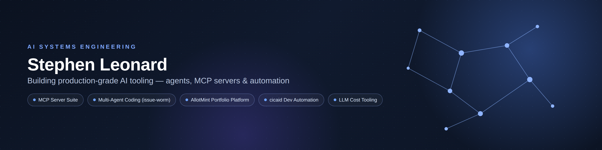

# AI Systems Lab



[](https://opensource.org/licenses/MIT)
[](https://github.com/leonarduk/ai-systems-lab)
[](https://github.com/leonarduk/ai-systems-lab)
[](https://www.python.org/downloads/)

**Personal portfolio demonstrating AI systems engineering capabilities.**

This repository documents my transition into AI systems engineering. Rather than just theory, I'm building production-quality tools and learning by doing. Some projects outgrow this lab and become their own repos — those are listed separately below.

---

## 🎯 What I'm Building (in this repo)

### [MCP Server Suite](./projects/01-mcp-server-suite/)
A collection of production-ready Model Context Protocol servers that enable LLMs to interact with external systems — GitHub, filesystems, git operations, email, web search, and more.

**Status:** Production-ready, actively maintained
**Tech stack:** Python, AsyncIO, MCP Protocol, REST APIs, GitHub API, SMTP

### [GitHub SDK App](./projects/02-github-sdk-app/)
A GitHub App built on the GitHub SDK for automating repo/issue/PR workflows.

### [Gmail Inbox Labeler](./projects/04-gmail-inbox-labeler/)
Moves messages out of a Gmail inbox into existing labels using a **local Ollama model** to classify them — no email content ever leaves the machine to a hosted LLM.

**Tech stack:** Python, Gmail API (OAuth2), Ollama

### [LLM Cost Comparison](./projects/05-llm-cost-comparison/)
Interactive tool that estimates and compares the real cost of running an LLM locally (owned hardware or rented cloud GPU) against hosted APIs, based on your own workload and, where possible, your own measured hardware — auto-detects GPU specs, benchmarks throughput, and prices multiple traffic scenarios side by side.

**Tech stack:** Python (stdlib only), `nvidia-smi`, live pricing lookups

### [Prize Draw Orchestrator](./projects/05-prize-draw-orchestrator/)
An MCP-driven agent that finds competition/prize-draw pages, filters them against configured criteria, reasons about eligibility with a swappable LLM backend (Ollama/DeepSeek/Claude), and enters eligible draws — with dry-run and personal-data safety gates on by default.

**Tech stack:** Python, MCP client protocol, configurable LLM backends

### [Octopus Agile Alert](./projects/06-octopus-agile-alert/)
Zero-dependency scheduled job that checks tomorrow's half-hourly Octopus Agile electricity prices and sends a webhook alert when a slot drops below a configurable threshold.

**Tech stack:** Python (stdlib only), GitHub Actions (daily cron)

### [LinkedIn Avatar](./projects/08-linkedin-avatar/)
An AI twin that talks to visitors about my career and my GitHub projects — one link, dropped into the Featured section of my LinkedIn profile. Grounded in a redacted CV plus a nightly-refreshed snapshot of this org's repos, it hands contact requests off via Telegram and stays within a hard daily spend cap.

**Status:** Live — [chat with it](https://ai-systems-lab-s8gy.onrender.com) or see the [landing page](https://leonarduk.github.io/ai-systems-lab/projects/08-linkedin-avatar/site/)
**Tech stack:** Python, Gradio, DeepSeek API, GitHub REST API, Telegram, Render, GitHub Pages

### Prompt Engineering Patterns
Structured prompts for code review, systems analysis, and log extraction with measurable outcomes — a systematic approach to LLM interaction design and output structuring.

📂 [View Prompts](./prompts/)

---

## 🚀 Projects That Grew Into Their Own Repos

Some ideas outgrew being "one project among several" here and became standalone repos with their own history, issues, and CI:

| Project | What it is |
|---|---|
| [issue-worm](https://github.com/leonarduk/issue-worm) | Multi-agent coder that works GitHub issues end-to-end (originally `07-multi-agent-coder` in this repo — see its [design doc](https://github.com/leonarduk/issue-worm/blob/main/docs/design.md) for the reasoning trail) |
| [allotmint](https://github.com/leonarduk/allotmint) / [allotmint-pro](https://github.com/leonarduk/allotmint-pro) / [allotmint-mcp](https://github.com/leonarduk/allotmint-mcp) | Portfolio/investment tracking platform, plus an MCP server exposing it (including an agentic research tool) to AI clients |
| [cicaid](https://github.com/leonarduk/cicaid) / [cicaid-pro](https://github.com/leonarduk/cicaid-pro) | CLI/automation tooling for AI-assisted GitHub issue and PR workflows (setup, review, triage) |
| [sing-attune](https://github.com/leonarduk/sing-attune) | Real-time pitch-tracking practice tool (GPU/CPU pitch engines, browser-based score sync) |

---

## 🛠️ Technologies I'm Working With

**Languages:** Python (primary), Java
**Cloud:** AWS (learning deployment patterns)
**AI/LLM:** OpenAI API, Anthropic Claude, MCP Protocol, local Ollama
**DevOps:** Docker, GitHub Actions

**Currently learning:** Vector databases, RAG pipelines, LLM observability, cost optimization

---

## 📚 My Background

**Senior Software Engineer** with 15+ years experience in:
- Backend systems (Java/Spring Boot, Python)
- AWS infrastructure and deployment
- Distributed systems and APIs
- Secure-by-design architecture

**Now focusing on:** Building AI systems that integrate with existing infrastructure, not just running notebooks or demos.

---

## 💭 Why This Repository?

I'm documenting my learning journey into AI systems engineering. Every project here:
- Solves a real problem I encountered
- Includes actual code, not just documentation
- Shows what I learned, including mistakes
- Demonstrates production thinking, not just functionality

This isn't about claiming expertise I don't have. It's about showing I can learn complex systems and build quality implementations.

---

## 🤝 Connect

**LinkedIn:** [linkedin.com/in/leonarduk](https://www.linkedin.com/in/leonarduk)

I'm exploring opportunities in AI systems engineering where I can leverage my backend/infrastructure experience while growing AI-specific skills.

---

## 📂 Repository Structure

```
ai-systems-lab/
├── projects/              # Complete project implementations
│   ├── 01-mcp-server-suite/
│   ├── 02-github-sdk-app/
│   ├── 04-gmail-inbox-labeler/
│   ├── 05-llm-cost-comparison/
│   ├── 05-prize-draw-orchestrator/
│   ├── 06-octopus-agile-alert/
│   └── 08-linkedin-avatar/
├── prompts/               # Prompt engineering examples
├── docs/                  # Architecture diagrams, guides, banner
├── examples/               # Reference implementations
```

---

*Last updated: August 30, 2026*
